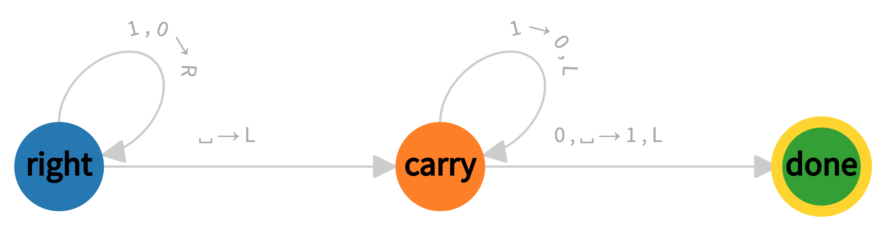
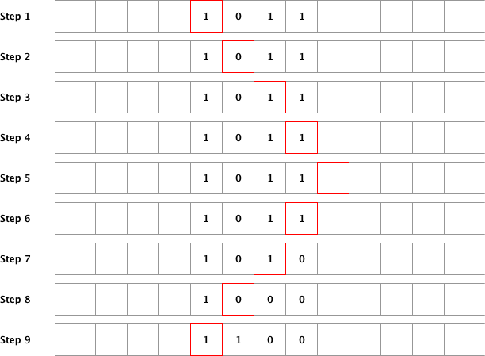
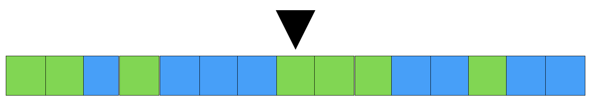
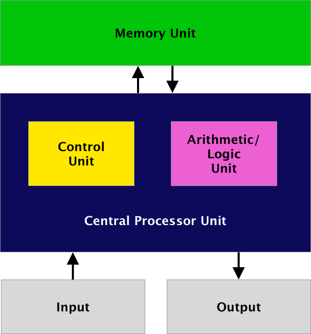

# Лекция 1: Формализации алгоритмов

В лекции представлены основные подходы к формализации в теории алгоритмов, анализируются исторические события, лежащие в основе и послужившие толчком к развитию различных формализаций. Большое внимание уделено понятию машины Тьюринга, как основному принципу построения современных языков программирования.

## Ключевые слова

Машина Бэббиджа. Алгоритм. Теоремы о неполноте формальных систем. Алфавит алгоритмического языка. Частично вычислимые функции. Формализации вычислительных машин. Машина Тьюринга. Машина Поста. Машина фон Неймана. Нормальный алгоритм Маркова. Лямбда-исчисление.

## От механика до киборга

С фразы «сейчас калькулятором, а тем более компьютером, никого не удивишь» начинались курсы большинства дисциплин, связанных с Computer Science. И это не случайно. Дух инноваций, дух изобретательства еще живет в поколениях, на глазах которых, всего в течение одной человеческой жизни произошла небывалая революция. Но есть то, что не менялось на протяжении всей компьютерной эры — большинство пользователей компьютеров очень слабо, если не сказать «вообще», не представляют, как работает компьютер.

На протяжении времени за программистами закреплялись определенные стереотипы. Сначала считалось, что программист — это непременно математик, физик, инженер-электроник. По мнению многих вход в профессию программиста предполагал глубокое понимание математики. И правда, изобретатели вычислительных машин были хорошими, даже гениальными математиками. Но знание элементарной математики вполне хватало и хватает для программирования, поскольку изначально вычислительные машины разрабатывались как универсальные.

У общественности складывалось мнение, что программирование не для всех. Но на деле это касалось системных программистов, работающих в основном над операционными системами, драйверами, специальными программами для численного моделирования, сложными библиотеками. Уже на заре компьютерной эры стало очевидно, что найти человека с квалификацией, достаточной для программирования компьютеров гораздо проще, чем гениального математика, который способен такой компьютер изобрести. Программистами первого в мире электронного цифрового вычислителя общего назначения ENIAC (сокр. от Electronic Numerical Integrator and Computer) стали шесть девушек, профессии которых хоть и были связаны с математикой, но это помогало им только в плане опыта работы с математической логикой. Теперь программистами становятся биологи, химики, лингвисты, переводчики, историки, журналисты и представители других профессий.

Согласно статистике, с развитием компьютеров квалификация программистов в области математики неизменно падает. В современном программировании математиков и физиков, да и инженеров-электроников, практически не осталось, и это, несомненно, огромное достижение, учитывая столь широкое применение программного обеспечения во всех сферах нашей жизни. Сейчас абсолютно любой энтузиаст может написать вполне достойное приложение для любимого устройства или платформы.

На заре компьютерной эры, как и обычно бывает со всем новым, программистов считали чудаками. Первым программистом, т.е. первым человеком, написавшим программу, была Ада Лавлейс (полное имя Августа Ада Кинг, урождённая Байрон, графиня Лавлейс, годы жизни 1815 — 1852), дочка того самого английского поэта Джорджа Гордона Байрона. В честь нее, кстати, был назван и язык программирования Ada [1], который разрабатывался 5 лет с 1975 года и до сих пор используется министерством обороны США. Гениальный вклад Ады состоял не только в том, что была написана первая программа [2 — 4], специально реализованная для воспроизведения на компьютере, которая производила расчёт чисел Бернулли. Ада Лавлейс не была ограничена весьма категоричными представлениями того времени и сформулировала видение будущей универсальной вычислительной машины, с которой мы теперь имеем дело каждый день. В записях она писала, что, подобно тому, как ткацкий станок Жаккарда может ткать цветы и листья, аналитическая машина способна создавать алгебраические формулы, а в перспективе — писать музыку, писать картины — и укажет «науке такие пути, какие нам и не снились».

Ада Лавлейс вопреки «предостережениям» общества стала бунтарем эпохи, доказала, что в мире мужской науки есть место и женщине. Стереотип программиста мужского пола, сложившийся в 60 — 80-е годы, также был давно уже разрушен, хотя многие и до сих пор воспринимают программистов-женщин весьма скептически, особенно пришедших из профессий, не связанных с точными науками.

Другим стереотипом этих лет стала профессия инженера-электроник. Если человек был программистом, то обязательно владел в совершенстве электроникой и схемотехникой, был обязательно радиолюбителем. Первые изобретатели персональных и полностью электронных вычислительных машин действительно были увлеченными радиолюбителями. Но сейчас в профессиональной среде программистов это скорее динозавры, гениальные изобретатели, но никак не рядовые сотрудники компании. Кажется, что они владеют магией создания объектов материального мира, которая зачастую кажется слишком сложной для постижения. Постепенно мир становится виртуальным, в будущем вряд ли понадобится слишком много внимания уделять объектам материального мира, останется чистое творчество во всех сферах жизни, вечное торжество разума. Можно будет себе сделать лучшее зрение, быстрые движения, всяческие сверх-способности. Грань между виртуальным и реальным с каждым днём становится всё прозрачней. Почти уже не осталось препятствий.

## Структура курса

У каждого учебного курса есть структура, но при изучении этого курса важно уделять больше времени тому, что вас действительно поражает. Нет таких ожиданий, которые вы бы не смогли воплотить. Это означает, что будет какой-то определённый теоретический и практический уровень, но вы сможете писать на интересующем вас языке, у вас будет время позаниматься той областью, которая вас в первую очередь интересует. Вас ждут множество приятных сюрпризов на этом пути, и каждое ваше достижение будет приносить вам не только мгновения триумфа. Минимальный уровень позволит вам при должном усердии и дополнительной тренировке устроиться на позицию Junior Developer в интересующую вас компанию. Что же вы должны знать и уметь? Каков этот минимум?

Конечно же вы должны знать про наиболее известные алгоритмы. Вы должны иметь опыт работы с наиболее часто применяющимися подходами и методами, практическими приёмами, знать и уметь применять объектно-ориентированное программирование (ООП). Вы должны ориентироваться в веб-технологиях, уметь работать с популярными форматами данных и API. Вы должны понимать, как работает команда программистов. У вас должно быть портфолио, которое демонстрирует глубину погружения в конкретный язык и его особенности. Это и есть ваш минимальный уровень.

Те, кто из вас думают, что имеют достаточный опыт программирования, попробуйте выполнить задания. Курс будет подстраиваться под ваш уровень, а вы глубже будете постигать интересующие вас технологии. Язык программирования тоже сможете выбрать вы. Задания будут раскрывать особенности каждого из актуальных на сегодняшний день языков, среди которых: [Python](https://www.python.org "The official home of the Python Programming Language"), [C++](https://isocpp.org "Standard C++"), [Java](https://www.java.com/ "Official Site of Java Language by Oracle"), [PHP](https://www.php.net "The PHP Group"), [JavaScript](https://developer.mozilla.org/en-US/docs/Web/JavaScript "JavaScript (MDN's Documentation)") и другие. Если вы находитесь перед выбором, то небольшое эссе по выбору вашего первого языка программирования позволит вам отбросить все сомнения, через последующее обсуждение с преподавателем.

Информации по программированию много. Список необходимых и дополнительных материалов для освоения базового уровня курса в рамках каждой отдельной лекции, каждого практического задания будет прилагаться. Обязательно представлены рекомендованные ресурсы для расширения кругозора, которые всегда будут располагаться в секции с пометкой «дополнительно». Дополнительные источники представлены в виде ненумерованного списка не случайно. Каждый из них, с учетом анализа материала, является важной составляющей вашей будущей профессиональной позиции, иллюстрируют вашу эрудицию и глубину. Эти материалы являются дополнительными и служат цели расширить ваш кругозор, который вполне может послужить конкурентным преимуществом на фоне коллег, а также обеспечит успешное расширение ваших профессиональных связей.

Что ещё важно? Будет полезно завести профиль на [GitHub](https://github.com) уже сейчас, в начале курса. У программистов принято иметь хорошее портфолио на этом ресурсе. Постепенно мы разберемся с принципами работы систем контроля версий, так мы вплотную приблизимся к написанию программ, когда разработчиков у приложения несколько. Несомненно, вам понадобится знать английский язык на достаточно хорошем уровне, поэтому мы будем использовать все инструменты для написания программ и работы с ними на английском языке. Более того, вам по ходу курса придется работать с английской документацией и статьями. Не пугайтесь, у нас не уроки английского, но со специфичной терминологией вам придется работать постоянно. Просто постарайтесь привыкнуть, это одно из обоснованных требований к вам, как к разработчику.

К материалам каждой лекции прилагаются не только вопросы для самопроверки, чтобы установить, достаточно ли вы хорошо усвоили материал. Практические задания служат для того, чтобы потренироваться и выработать определённые навыки. Они будут оттачиваться в специальных практических заданиях. Также присутствуют и сопутствующие материалы, работа с которыми позволит вам лучше усвоить знания, изложенные в лекции (презентация лекции, текстовый вариант, аудиоверсия и видео). Используйте то, что вам будет удобнее.

Что ждет вас после каждой лекции:
1. Необходимо выполнить задания на усвоение знаний. Это могут быть составления различных схем, построение диаграмм, формирование таблиц, создание интеллект-карт.
2. После прохождения заданий необходимо будет сдать тест, чтобы подтвердить, что материал усвоен вами.
3. Следующий этап — это выполнение обязательных и дополнительных практических заданий.

Выполнение всех тестов ко всем лекциям на удовлетворительный бал в совокупности с успешной сдачей обязательных практических заданий даст вам возможность получить минимум знаний и практических навыков. Не забывайте о практических занятиях, на которых будут проходить мастер-классы по каждой теме, которая касается непосредственно работы программиста. Они направлены на то, чтобы поделиться с вами с самыми последними технологиями и инструментами, которыми пользуются современные разработчики программного обеспечения.

Ваша работа над курсом должна быть ритмичной. Каждая неделя будет состоять из одной лекции, одного практического занятия, набора тестов и практических заданий. У вас много самостоятельной работы, поскольку только через индивидуальную практику можно научиться программировать.

Программист это прежде всего специалист в технологиях и, как правило, дилетант в предметной области. Именно поэтому вас ждёт много практических заданий из абсолютно разных сфер. Вы должны научится правильно применять технологии, быть достаточно мобильными, всегда смотреть на перспективу, адаптировать каждый шаг для достижения максимального эффекта. Любовь к высоким технологиям в этом вам может помочь. Вы увидите, как совершенно разные сферы нуждаются в программном обеспечении, сколько всего ещё не сделано на этом поприще.

## Понятие алгоритма

В Большой российской энциклопедии [5] даётся такое определение алгоритму:

> АЛГОРИ́ТМ (от al­go­rithmi — лат. на­пи­сания араб. име­ни аль-Хо­рез­ми), инструк­ция, точ­ное опи­са­ние спо­со­ба дей­ст­вия с ис­поль­зо­ва­ни­ем про­стых, об­ще­по­нят­ных эле­мен­тов (напр., опе­ра­ций)

Попахивает математикой? Именно так. Корни современного понимания алгоритма лежат в представлениях математиков начала и середины XX века. Чтобы полноценно раскрыть понятие алгоритма и осознать его на более высоком уровне, обычно пользуются определением смежных понятий:

* **Дискретность**: алгоритм — это последовательное выполнение элементарных шагов за конечное время.
* **Детерминированность (определённость)**: на любом этапе выполнения алгоритма его дальнейшие шаги однозначно должны быть определены состоянием системы, что позволяет для одних и тех же входных данных получать всегда один и тот же ответ.
* **Понятность**: алгоритм должен включать в себя только известные или стандартизированные в командах действия, понятные программистам.
* **Завершаемость (конечность)**: алгоритм должен решать задачу за определенное число шагов.
* **Массовость (универсальность)**: алгоритм должен быть применим не только к конкретной задаче, но к классу или подклассу схожих задач, иначе полезность его становится дискуссионным вопросом.
* **Результативность**: алгоритм всегда должен приводить к результату.

Каждый раз, когда вы будете писать программу на том или ином языке программирования, вы будете создавать алгоритмы её работы. Сразу надо оговорится, что алгоритмы могут быть заданы по-разному: императивно и декларативно. Большая часть массовых языков программирования императивна. Императивная программа непосредственно создается программистом, который определяет каждый шаг алгоритма. Очевидно, что это связана с интуитивно понятным нам процессом: программист просто «приказывает», что нужно делать вычислительной машине, а она уже «старается» сама выполнить каждый шаг точно и в заданный срок. Совершенно иным является декларативный подход, когда программист описывает, что нужно сделать, какой результат нужно получить, а уже сам компьютер «решает», как ему осуществить всё, что взбрело в голову программисту. Этот путь чуть менее очевиден для человека, но даёт поистине большую свободу при практической деятельности. Мы понимаем, что свобода предполагает и некую ответственность. Практикуя декларативный подход, нужно помнить, что за «просчёты» компьютера будет нести ответственность именно программист. Так с чего же началась золотая эпоха вычислительных машин? Началось всё с математиков и пытливости ума.

### Теоремы Курта Гёделя и Entscheidungsproblem

В 1900 году немецкий математик Давид Гилберт сформулировал и представил на II Международном конгрессе математиков в Париже список из двадцати трёх кардинальных проблем математики. К слову сказать, до сих пор полностью было решено только шестнадцать из них. Вторая проблема их списка звучит так: «аксиомы арифметики противоречивы или нет?»

Курт Гёдель (австрийский ученый, уроженец города Брно), в 1930 году в своих знаменитых двух теоремах доказал, что непротиворечивость аксиом арифметики нельзя доказать, исходя из самих аксиом арифметики (если только арифметика не является на самом деле противоречивой). Первая теорема утверждает, что если формальная арифметика непротиворечива, то в ней существует невыводимая и неопровержимая формула. Вторая теорема утверждает, что если формальная арифметика непротиворечива, то в ней невыводима некоторая формула, содержательно утверждающая непротиворечивость этой арифметики. Позже в 1936 году сформулированную Гильбертом проблему доказал уже другим способом Герхард Генцен (немецкий ученый). До сих пор нет консенсуса, решена эта проблема или нет, результат требует дополнительного уточнения формулировки.

Однако теоремы Гёделя и формулировка все тем же Давидом Гильбертом проблемы неразрешимости (Entscheidungsproblem) в 1928 году послужили отправной точкой и вдохновением для многих математиков того времени, которые занимались проблемой создания универсальных вычислительных машин: это и Эмиль Пост (уроженец Российской Империи, американский ученый), и Алан Тьюринг (английский ученый), и Алонзо Чёрч (американский ученый, научный руководитель в докторантуре у Алана Тьюринга), и А.А. Марков. (уроженец Российской Империи, советский ученый) и другие. Но для начала нужно было сформулировать, что же такое алгоритм.

Было разработано несколько определений понятия алгоритм, в контексте возможности формализации задачи разработки универсального вычислителя. В конечном итоге всё свелось к формулировке нескольких тезисов. Позже было доказано, что все эти тезисы эквивалентны и могут быть сведены к единому тезису. В качестве единственного был определён тезис Чёрча-Тьюринга, сформулированный математиками независимо в 1936 году [7, 8]: для любой алгоритмически вычислимой функции существует вычисляющая её значения машина Тьюринга.

Такую гипотезу не возможно строго доказать или опровергнуть. Тезис Чёрча-Тьюринга устанавливает эквивалентность между строго формализованным понятием частично-вычислимой функции и неформальным понятием вычислимости. Этот тезис является аксиомой, постулатом, и не может быть доказан математическими методами, поскольку алгоритм не является точным математическим понятием. За это и держимся.

Ну и что, спросите вы? Опять очередная математическая абстракция. Но самое интересное для нас здесь машина Тьюринга. Чуть позже мы подробно остановимся на ней и различных других способах формализации универсальных вычислительных машин. Вам наверняка интересно будет узнать, что языки программирования, которыми мы оперируем сейчас, точнее компиляторы и интерпретаторы этих языков, основаны на принципах, определенных в 30 — 50-х годах XX века. Но прежде всего мы должны разобрать такие понятия, как алфавит и отображение.

### Новая азбука

Интуитивно понятно, что алгоритм — это способ прийти от каких-то входных данных к каким-то выходным данным. Каким же образом можно задать эти данные? Для этого используется замечательное и не менее интуитивное понятие алфавита. В математике, а мы пока полностью в её власти, алфавит определяется как конечное множество элементов (1.1):

<div>\[A_p= \{{a_1},\ {a_2},\ ...\ ,\ {a_p}\}\]</div>

Элементы алфавита называются символами. Последовательность из _m_ символов называется словом над алфавитом (1.2):

<div>\[A_p^*= {\epsilon}\cupA_p\cup{A_p^2}\cup\ ...\ \cup{A_p^m}\cup\ ...=\bigcup_m=0^{\infty}{A_p^m}\]</div>

Слово нулевой длинны называется пустым словом. Множество всех слов над алфавитом можно представить в виде (1.3):

<div>\[\omega\in{A_p^*}\]</div>

Необходимо также и задать длину слова (1.4):

<div>\[F(\omega)=\nu;\ \nu,\ \omega\in{A_p^m}\]</div>

Теперь определимся с понятием алгоритма, как задачи обработки информации, в новом формализме. Алгоритм, это штука, которая ставит в соответствие в общем виде набору слов из одного алфавита набор слов из другого (в частном случае того же) алфавита. Стало быть, можно записать алгоритм как некую частично-определенную функцию, частичное отображение, аргументами которой будет слово определенной длины или набор слов, а результатом — набор слов, а общем случае любых и определяющих смысл выполнения алгоритма, т.е. получение результата.

## Основные формализации

Теперь можем перейти к основным формализациям, которые и определили путь развития будущей вычислительной техники. Наибольшее внимание уделим машине Тьюринга, но также рассмотрим и альтернативы, интересные не только с позиции расширения кругозора, а прежде всего с точки зрения определения фундамента для развития принципиально отличающихся направлений эволюции вычислительных машин.

### Машина Тьюринга

Основная идея очень проста. Это абстрактная машина (автомат - термин, к которому мы часто будем прибегать в курсе), работающая в общем случае бесконечной лентой ячеек, каждая из которых содержит символ. Вдоль ленты может перемещаться головка для записи и чтения символов из ячеек. На каждом шаге машина считывает символ из ячейки, на которую указывает головка, и, на основе считанного символа и внутреннего состояния, делает следующий шаг. При этом машина может изменить своё состояние, записать другой символ в ячейку или передвинуть головку на одну ячейку вправо или влево. В некоторых нотациях предполагается, что действий может быть несколько на каждом шаге. Но мы для простоты будем рассматривать машину, которая на каждом шаге совершает лишь одно действие: головка по считываемому символу может сместиться влево или вправо, может считать или записать новый символ (в том числе и специальный символ, который называется маркером). Таким образом, у нас имеется алфавит символов, алфавит маркеров, бесконечная лента, перемещающаяся влево и вправо головка для чтения и записи, и набор правил, по которым происходит то или иное действие. Необходимо отметить также, что действие однозначно определяется парой символа и состояния.

Хорошим примером будет бесконечный листок бумаги в клеточку, которая нарезана на полоски шириной в одну клетку. В каждой клеточке имеется символ, который можно считать или переписать, нельзя только удалить. Для простоты будем рассматривать машину, которая совершает всё же только одно действие за шаг. Так вот любой вычислимый алгоритм можно реализовать на описанной Тьюрингом машине.

Давайте реализуем что-то простое. Например, попробуем реализовать машину, которая способна реализовать операцию инкремента. У нас есть некоторое целое число, для простоты будем использовать двоичные числа.

Для того, чтобы можно было оперировать с умозрительной машиной, Тьюринг ввел две эквивалентные нотации, которые впоследствии были названы таблицей Тьюринга и диаграммой Тьюринга. Проиллюстрируем работу предлагаемой машины, используя оба типа нотаций, чтобы попрактиковаться, а также для того, чтобы было легче выполнить ваше первое практическое задание в этом курсе.

Для визуализации работы машины будем использовать отличный инструмент с открытым [исходным кодом](https://github.com/aepsilon/turing-machine-viz) [http://turingmachine.io](http://turingmachine.io). Для программирования собственных машин Тьюринга с помощью этого инструмента (а это вам и будет необходимо сделать в первом практическом задании) вы будете использовать один из популярных форматов конфигурационных файлов [YAML](https://en.wikipedia.org/wiki/YAML).

Давайте попробуем разобраться. Что нужно нам для того, чтобы осуществить инкремент [двоичного числа](https://ru.wikipedia.org/wiki/%D0%94%D0%B2%D0%BE%D0%B8%D1%87%D0%BD%D0%B0%D1%8F_%D1%81%D0%B8%D1%81%D1%82%D0%B5%D0%BC%D0%B0_%D1%81%D1%87%D0%B8%D1%81%D0%BB%D0%B5%D0%BD%D0%B8%D1%8F)? В первую очередь попробуем увеличить значение двоичного числа на один на бумаге. Запишем произвольное двоичное число. Например, пусть это будет 1011. Прибавим к нему единицу. Сложение начинается с младшего разряда. Так как в младшем разряде стоит единица, необходимо перенести единицу в старший разряд, а значение приравнять 0. Во втором разряде у нас также стоит единица, поэтому повторяем то, что мы проделали для первого разряда числа. А вот в третьем разряде находится 0, его мы должны заменить на единицу, которая пришла из младшего разряда. Простейшее сложение в столбик из младших классов школы. Для чего нам были нужны такие упражнения? Для того, чтобы составить набор правил (алгоритм) для работы нашей машины.

На ленте мы должны будем поместить исходное число, каждый разряд в отдельной ячейке. Алфавит символов данных у нас будет состоять из двух символов: 0 и 1. Необходимо определить и пустую ячейку специальным символом. Можем использовать для этого пробел, задающим разметку на ленте, т.е. маркером. Таким образом, алфавит маркеров будет состоять из одного символа. Затем нам надо определиться с состояниями машины. Безусловно, мы должны иметь начальное и конечное состояния. Начальное, чтобы определить с чего мы начинаем, и конечное, которое будет указывать на завершение программы. Но нужно и третье состояние, которое непосредственно будет производить увеличение значения на единицу. Таким образом, мы должны использовать три состояния.

А теперь установим правила. Пусть начальное состояние будет у нас, когда положение головки находится на старшем разряде. Поскольку сложение необходимо начинать с младшего разряда, нужно головку передвинуть влево до тех пор, пока не встретится пустой символ. А в этом случае вернуть головку на ячейку слева. Когда головка установлена на младшем разряде необходимо проверить, какое символ находится в ячейке. Если 1, то необходимо передвинуть головку влево, если 0, то записать 1 и передвинуть головку влево. А если в ячейке пустая, то необходимо передвинуть головку вправо.

В нотации таблиц Тьюринга для записи правил работы машины принято формировать специальную таблицу инструкций (таблица 1.1). В первом столбце в строках обозначаются все возможные состояния _q_ с индексами от 0 до s (алфавит состояний), а в первой строке в столбцах указываются возможные символы. На пересечении в ячейках записываются операции. Если операций необходимо записывать несколько, то они пишутся подряд. Прописными буквами обозначаются переходы головки влево (l) и вправо (r). Буквой q с новым индексом обозначаются переходы машины в новое состояние. Все возможные символы алфавита данных и алфавита маркеров обозначаются остальными символами. В ячейках таблицы можно найти инструкцию для машины (одну или несколько операций), которая должна быть реализована при считывании головкой символа в ячейке с учетом текущего состояния.

Таблица 1.1. Алгоритм бинарного инкремента в нотации таблицы Тьюринга

<table class="striped">
  <tbody>
    <tr>
      <th scope="col"></th>
      <th>0</th>
      <th>1</th>
      <th></th>
    </tr>
    <tr>
      <th scope="row">q0</th>
      <td>r</td>
      <td>r</td>
      <td>l q1</td>
    </tr>
    <tr>
      <th scope="row">q1</th>
      <td>1 l qs</td>
      <td>0 l</td>
      <td>1 l qs</td>
    </tr>
    <tr>
      <th scope="row">qs</th>
      <td>—</td>
      <td>—</td>
      <td>—</td>
    </tr>
  </tbody>
</table>

Попробуем использовать другую нотацию (рис. 1.1). Она более наглядная, поэтому именно ее мы и будем использовать при работе с машиной Тьюринга.


Рисунок 1.1. Алгоритм бинарного инкремента в нотации диаграммы Тьюринга

Набор инструкций на языке YAML для указанного выше инструмента будет выглядеть следующим образом:

```yaml
# Adds 1 to a binary number.
input: '1011'
blank: ' '
start state: right
table:
 # scan to the rightmost digit
 right:
  [1,0]: R
  ' ' : {L: carry}
 # then carry the 1
 carry:
  1   : {write: 0, L}
  [0,' ']: {write: 1, L: done}
 done:
```

Обратите внимание, что кроме самих инструкций в тексте указаны и специальные строки с комментариями, которые пишутся на английском языке и начинаются с символа #. Внимательно изучите пример, чтобы разобраться с тем, как все устроено. На рисунке 1.2 показана работа машины Тьюринга по шагам.



Рисунок 1.2. Алгоритм бинарного инкремента с помощью машины Тьюринга

#### Модификации машины Тьюринга

Модель машины Тьюринга легко допускает расширения, чем и воспользовались исследователи середины прошлого века. Предлагали машины Тьюринга с произвольным числом лент и многомерными лентами, с различными ограничениями ленты или лент. Однако все эти машины сводятся к полной машине по Тьюрингу и моделируются обычной машиной Тьюринга. Среди других машин стоит отметить машину, работающую на полубесконечной ленте, что удобно для моделирования универсальной машины Тьюринга, и муравья Лэнгтона. Вот список интересных машин, о которых полезно почитать, чтобы «размять» мозги:

- Недетерминированная машина Тьюринга,
- Вероятностная машина Тьюринга,
- Квантовая машина Тьюринга,
- Теория алгоритмов,
- Тьюринговская трясина,
- Диаграмма Тьюринга,
- Машина Минского.

#### Универсальная машина Тьюринга

Наибольший интерес представляет универсальная машина Тьюринга, которая способна исполнять другие машины. Что это значит? Занимаясь написанием кода, вы, практически сразу, столкнетесь с желанием использовать уже написанную и отлаженную раз программу в дальнейшем. Есть отличный принцип - Do Not Repeat Yourself (DRY). Процесс повторного использования кода называется «переиспользование» или «reuse». И действительно, зачем каждый раз писать то же самое. На заре компьютерной эры уже стало очевидным, что действовать иначе просто не эффективно. Особенно, это стало очевидно, когда начала активно развиваться промышленная разработка программного обеспечения в коммерческих компаниях. 

Тьюринг стремился оптимизировать все, что его окружало. Примерно тогда зародилось и понятие архитектуры программного обеспечения, которая выражается в построении кода определенным образом по средствам введения абстракций. Это позволяет эффективно использовать труд программистов.

Тьюринг ввел понятие элементарных машин Тьюринга, т.е. машин, которые осуществляют какие-то рутинные действия. В диаграммах и таблицах Тьюринга были введены новые обозначения в виде точек и букв, как правило из греческого алфавита, которые обозначали применение этих самых элементарных машин. Точка до буквы означала начальное состояние элементарной машины, точка после — конечное состояние или, по-другому состояние останова. Давайте приведем пример.

Возьмем уже созданную машину, которая прибавляет единицу к двоичному числу. Если посмотреть на рисунок 1.2, то мы можем заметить, что у нас наблюдаются две рутинные операции: проход вправо до пустой ячейки, и проход влево с преобразованием числа. Эти проходы можно заменить на отдельные элементарные машины, т.е. набор правил как бы «свернуть». Наиболее близкий пример — переобозначение переменных в алгебре, когда вы, например, можете решение уравнения с тригонометрическими тождествами свести в решению квадратного или кубического уравнения, с последующей обратной заменой. Другой пример — интегрирование по частям. Математика предоставляет нам великолепные инструменты.

Интересно, что универсальную машину Тьюринга становится возможным использовать для запуска других машин. Это очень похоже на запуск приложений в любой современной операционной системе. Как правило, очень хорошая модель машины Тьюринга, подходящая для этого, это модель машины с ограниченной лентой с одного конца. Это не нарушает общности. Вся сила бесконечности в том, что если мы сделаем с одной стороны ленту конечной, длина ее останется бесконечной. Для чего это делается в данном случае? Очень просто. Так можно разместить запускающую машину в начале ленты, а потом, после специального маркера разместить элементарные машины и более сложные машины, записав правила и данные на ленту. Сложно? Да! Но не невозможно.

### Машина Поста

В 1936 году была опубликована работа Эмиля Поста [9]. Он представил свою машину, которая оказалась эквивалентной машине Тьюринга. Машина Поста (рис. 1.3) состоит из схожих частей: каретки (аналог считывающей и записывающей головки машины Тьюринга) и разбитой на ячейки бесконечной в обе стороны ленты. Вот только ячейка ленты может находиться только в двух состояниях пустая и заполненная (0 или 1). За один такт работы машины Поста каретка также может сдвинуться на одну позицию влево или вправо, считать или изменить символ в текущей позиции.


Рисунок 1.3. Машина Поста

Главное отличие заключается в том, что набор инструкций определяется не правилами, а программой, состоящей из конечного числа строк. Для работы машины нужно задать программу и её начальное состояние (то есть состояние ленты и позицию каретки). Кареткой управляет программа, состоящая из пронумерованных не обязательно упорядоченных строк команд. Команды могут быть не упорядочены, если в каждой команде указана строка, на которую нужно перейти. Как правило, если в команде переход не указан, то переход происходит на следующую строку. После запуска программы возможны следующие три варианта развития событий:

* работа машины может закончиться невыполнимой командой (например, стирание несуществующей метки или запись в помеченное поле),
* работа машины может закончиться командой «стоп»,
* работа машины продолжается.

Похоже, что машина Поста представляется более простой для понимания, чем машина Тьюринга, но тем не менее они эквивалентны и могут быть сведены одна к другой.

### Машина фон Неймана

Архитектура фон Неймана (модель фон Неймана, Принстонская архитектура) — это принцип организации вычислительной машины (рис. 1.4) [10]. Отличается он от описанных выше тем, что он не только представляет собой модель универсального вычислителя, но еще и является удобным с точки зрения реализации. Под удобством надо понимать возможность относительного несложного построения реального физического устройства (электронной схемы) и возможность удобно писать, хранить и выполнять программы. В общем случае эта архитектура позволяет совместно хранить и команды, и данные в памяти компьютера.


Рисунок 1.4. Архитектура (машина) фон Неймана

Характеристики, свойства, преимущества и недостатки архитектуры фон Неймана опустим, предоставим это для изучения в рамках курса по архитектуре ЭВМ и операционным системам. Нас же может интересовать лишь принцип построения программ на такой, самой распространенной среди современных компьютерных систем, архитектуре. С нашей точки зрения архитектура и машина фон Неймана является эквивалентным понятием. Каким же образом программируют машину фон Неймана?

Сначала рассмотрим коротко архитектуру. В первую очередь необходимо отметить два блока: блок управления (Control Unit) и арифметико-логическое устройство (АЛУ, Arithmetic/Logic Unit). Эти два блока являются основой для центрального процессора (Central Processor Unit) и позволяют исполнять все команды, из которых состоит программа. В современных процессорах, как вы уже наверное знаете, присутствует несколько процессоров или вычислителей (АЛУ). Они позволяют по заданным правилам производить различные математические операции (сложение, вычитание, умножение, деление). Блок управления служит для организации работы АЛУ или нескольких АЛУ, а также в современных процессорах за множество различных других операций: работа с кэшем, регистрами, предсказание следующих математических операций и т.п. Вы должны знать, что современные процессоры содержат также и специальные АЛУ. Примером может служить нейропроцессоры, процессоры для шифрования данных, видеопроцессоры, шейдеры и др. Но мы в этом курсе занимаемся не презентацией современных смартфонов.

Следующим блоком является память, в которой хранятся не только дынные, но и программы: список операций над данными (список команд для процессора используемой архитектуры). В первую очередь из прочих характеристик нам важно знать разрядность памяти. Если вы осознанно покупали компьютер себе или помогали с покупкой другим, вы наверняка обращали внимание на разрядность процессора и памяти. Сейчас почти везде используется 64-разрядные системы. Что это значит? Это значит, что возможны операции с числами, максимальные значения которых определяются максимальным значением возможного выделенного места в памяти. Про это (типы данных) мы будем говорить уже в третьей лекции. Еще разрядность определяет максимально возможное адресное пространство памяти. Т.е. максимальная память будет определяться значением степени двойки. Два в шестьдесят четвертой степени равно 1 844 674 407 370 955 000. Именно со столькими ячейками памяти потенциально может работать центральный процессор. Машина фон Неймана отличается использованиям произвольного доступа к памяти, что очень удобно для написания программ. Сразу же вспоминается понятие переменных и констант тем, кто написал хотя бы одну программу в своей жизни.

Последней частью машины фон Неймана является шина данных, которая обеспечивает доступ процессора к устройствам ввода (клавиатура, мышь, и т.п.) и устройствам вывода (монитор, принтер). Интересно, что каждое устройство также имеет свой адрес и размер памяти. Он определяется системой адресации шины. Системы адресации для шины данных претерпели значительные изменения в последние 20 лет, что и позволило на голову превзойти компьютеры XX века.

Архитектура фон Неймана дала возможность программистам относительно свободно писать программы для компьютеров, перевернула понимание вычислительной машины уже для нескольких поколений.

### Нормальный алгоритм Маркова

Нормальный алгоритм, который в конце 40-х годов XX века ввел А.А. Марков, — это полный по Тьюрингу язык, который описывает метод переписывания строк. Если кто-то имел дело с заменой символов или строк в текстовых редакторах, то будет сразу понятно. Другим, даже более хорошим примером будет замена с использованием регулярных выражений, с которыми мы подробно ещё познакомимся. Нормальный алгоритм Маркова по выразительной силе эквивалентен машине Тьюринга и, следовательно, современным языкам программирования. На основе нормального алгоритма Маркова в 1966 году Валентин Турчин создал функциональный язык программирования Рефал.

Определение всякого нормального алгоритма состоит из двух частей: определения алфавита алгоритма и определения его схемы. Схемой нормального алгоритма называется конечный упорядоченный набор так называемых формул подстановки, каждая из которых может быть простой или заключительной. Простыми формулами подстановки называются слова вида L → D, где L и D — два произвольных слова в алфавите алгоритма (называемые, соответственно, левой и правой частями формулы подстановки). Аналогично, заключительными формулами подстановки называются слова вида L →⋅ D. При этом символы → и ⋅ не принадлежат алфавиту, или нужно на их управляющую роль выбрать другие два символа.

Давайте рассмотрим пример работы алгоритма Маркова. Опишем следующий алгоритм:

<div>\[\begin{cases}|b\rightarrow{ba|}\\ab\rightarrow{ba}\\b\rightarrow\\*|\rightarrow{b*}\\*\rightarrow{c}\\|c\rightarrow{c}\\ac\rightarrow{c|}\\c\rightarrow{\cdot}\end{cases},\]</div>

Для слова |\*|| алгоритм будет работать следующим образом:

<div>\[\begin{multline}|*||\Rightarrow{|b*|}\Rightarrow{ba|*|}\Rightarrow{a|*|}\Rightarrow{a|b*}\Rightarrow{aba|*}\\\Rightarrow{baa|*}\Rightarrow{aa|*}\Rightarrow{aa|c}\Rightarrow{aac}\Rightarrow{ac|}\Rightarrow{c||}\end{multline}\]</div>

Существует достаточно интересный [инструмент](http://www.cmcmsu.info/1course/alg.schema.nam.htm) для того, чтобы можно было поэкспериментировать с нормальным алгоритмом Маркова. Вы можете попробовать поработать поработать с ним на [iOS](https://apps.apple.com/us/app/markov-algorithm/id1427691412) или [Android](https://play.google.com/store/apps/details?id=com.kudryavtsev.anton.markovalgorithm&hl=en&gl=US). В качестве второго практического задания к курсу будет реализация алгоритма с помощью данного формализма. Сам подход довольно прост, вам представляется возможность разобраться с его особенностями самостоятельно через опыт реализации конкретной задачи.

### Комбинаторная логика и лямбда-исчисление

Для полноты картины не хватает ещё одного способа формализовать алгоритм. Комбинаторная логика — направление математической логики, занимающееся фундаментальными (то есть не нуждающимися в объяснении и не анализируемыми) понятиями и методами формальных логических систем или исчислений. В дискретной математике комбинаторная логика тесно связана с лямбда-исчислением, так как описывает вычислительные процессы. В курсе дискретной математики детально рассматривается понятие комбинаторной логики. Мы же посмотрим скорее на подход, который в конце 40-х годов XX века использовал Алонзо Чёрч для описания вычислительных процессов. Есть не мало курсов, которые посвящены детальному разбору понятий функционального программирования и лямбда-исчислению, с ним непосредственно связанного. Мы же остановимся на общем описании подхода, как примера альтернативного способа математического описания вычислительной машины.

В беседах программистов часто можно услышать о лямбда-функциях, под которыми понимается механизм «анонимных функций» (callback functions), которые можно определить прямо в том месте, где они используются, и которые имеют доступ к локальным переменным текущей функции — замыканию. Мы обязательно познакомимся с замыканиями и тем, как они реализуются в различных языках программирования. Отличный и весьма модный в последние годы метод реализации реактивности в программах. Много новых терминов. Не пугайтесь, скоро вы начнете ориентироваться в них. Эти вот лямбда-функции пришли как раз из лямбда-исчисления — основы функционального программирования.

В математике лямбда-исчисление — это система для формализации и анализа понятия вычислимости. Это не язык программирования, а формальный аппарат, способный определить в своих терминах любую языковую конструкцию или алгоритм [11, 12]. В этом смысле лямбда-исчисление созвучно машине Тьюринга, но только соответствует функциональной парадигме, а не императивной. Мы с вами рассмотрим только чистое нетипизированное лямбда-исчисление. Зададим основную терминологию.

**Терм** — это выражение формального языка специального вида. Если провести аналогию с естественным языком, где группа слов ссылается на конкретный объект, а предложение, состоящее из групп слов, — на факт, терм обозначает объект, а формула — факт [13]. Соответственно, в формуле может присутствовать несколько термов.

Для обозначения функции используют **лямбда-абстракцию** (анонимную функцию) в виде терма _λx.t_, где _x_ — аргумент функции, _t_ — её тело. Применение функции (**аппликация**) обозначается через терм _f x_, где _f_ — функция, _x_ — подставляемое в неё значение аргумента.

Нам также необходимо ввести соглашение о приоритетах операций:

1. Применение функции левоассоциативно. Т.е. _s t u_ — это тоже самое, что _(s t) u_.
2. Аппликация (применение или вызов функции по отношению к заданному значению) забирает себе всё, до чего дотянется. Т.е. _λx. λy. x y x_ означает то же самое, что _λx. (λy. ((x y) x))_.
3. Скобки явно указывают группировку действий.

Может показаться, будто нам нужны какие-то специальные механизмы для функций с несколькими аргументами, но на самом деле это не так. В мире чистого лямбда-исчисления возвращаемое функцией значение тоже может быть функцией. Следовательно, мы можем применить первоначальную функцию только к одному её аргументу, «заморозив» прочие. В результате получим новую функцию от «хвоста» аргументов, к которой применим предыдущее рассуждение. Такая операция называется **каррированием** (в честь [Хаскелла Карри](https://ru.wikipedia.org/wiki/%D0%9A%D0%B0%D1%80%D1%80%D0%B8,_%D0%A5%D0%B0%D1%81%D0%BA%D0%B5%D0%BB%D0%BB), разработчика комбинаторной логики, как и два известных функциональных языка программирования — [Haskell](https://ru.wikipedia.org/wiki/Haskell "Haskell") и [Curry](https://ru.wikipedia.org/wiki/Curry "Curry")).

Рассмотрим процесс вычисления для следующего терм-применения _(λx.t) y_. Его левая часть _(λx.t)_ — это функция с одним аргументом x и телом t. Каждый шаг вычисления будет заключаться в замене всех вхождений переменной x внутри _t_ на _y_. Терм-применение такого вида носит имя **редекса** (от reducible expression, redex — сокращаемое выражение), а операция переписывания редекса в соответствии с указанным правилом называется **бета-редукцией**. Если в терме больше нет редексов, то говорят, что он вычислен, или находится в нормальной форме. Не каждый терм имеет нормальную форму, например _(λx.xx)(λx.xx)_ на каждом шаге вычисления будет порождать самоё себя (здесь первая скобка — анонимная функция, вторая — подставляемое в неё на место _x_ значение).

Таким образом, мы имеем дело с новой формализацией, в которой, как и нормальном алгоритме Маркова, очень много математического формализма, а не инженерного, как это было в машинах Тьюринга и Поста. Получается, что подходов достаточно много. Но на сегодняшний день из всех наиболее прижились формализация с помощью машины Тьюринга (на ней основывается большинство императивных языков, т.е. подавляющее большинство языков программирования) и лямбда-исчисление Чёрча. В то же время, современные языки программирования достигли такого уровня развития, что остается только определенные стили программирования на том или ином языке. Практически каждый популярный язык является мультипарадигмальным, что позволяет использовать различные формализации в рамках синтаксиса одного языка. Мы кратко рассмотрели только две парадигмы программирования, вернее их математические основы: императивное и функциональное. В курсе мы также будем рассматривать еще один, наиболее популярный на сегодняшний день, подход — объектно-ориентированное программирование. На практике, выполняя практические задания, вы научитесь использовать тот или иной подход.

---- 

В следующей лекции мы больше внимание уделим алгоритмам, которые реализуются на машине фон Неймана, их анализу и характеристикам, а также напишем свою первую программу.

> Для самопроверки после изучения содержания всей лекции можете проверить Ваш уровень осознания, обратившись к списку вопросов для самопроверки. Вы также можете воспользоваться настоящим текстом, аудиозаписью или видео лекции или посмотреть что-то из списка видеоматериалов, чтобы лучше разобраться в материале.

## Резюме

Итак, мы рассмотрели с вами различные подходы к формализации понятия алгоритма. Рассмотрели понятие вычислительной машины и другие подходы к формализации. В следующей лекции мы рассмотрим понятие алгоритма подробнее на примере простых задач и подходы к измерению характеристик произвольного алгоритма, значимых с точки зрения практики.

## Сопутствующие материалы

1. Видео лекции. — URL: [https://igsekor.com/course/programming/week-1/video/](https://igsekor.com/course/programming/week-1/video/) (Дата обращения: 04.02.2023).
1. Аудиоверсия лекции. — URL: [https://igsekor.com/course/programming/week-1/audio/](https://igsekor.com/course/programming/week-1/audio/) (Дата обращения: 04.02.2023).
1. Презентация лекции. — URL: [https://igsekor.com/course/programming/week-1/keynote/](https://igsekor.com/course/programming/week-1/keynote/) (Дата обращения: 04.02.2023).
1. Презентация лекции в PDF. — URL: [https://igsekor.com/course/programming/week-1/keynote/index.pdf](https://igsekor.com/course/programming/week-1/keynote/index.pdf) (Дата обращения: 04.02.2023).

## Вопросы для самопроверки

1. Перечислите страны, в которых работали математики и инженеры над проблемой неразрешимости (Entscheidungsproblem).
1. Нарисуйте модель универсальной машины Тьюринга.
1. Нарисуйте диаграмму Тьюринга для алгоритма поиска парных скобок на ленте.
1. Перечислите команды в формализме алгоритма Маркова, которые переведут фразу «Hello,» в «World!».
1. Являются ли регистры процессора составляющей процессора? (требует самостоятельного изучения)

## Практические задания

1. С помощью [http://turingmachine.io](http://turingmachine.io) для машины Тьюринга реализуйте алгоритм копирование двоичного числа в ячейки справа от исходного. Загрузите Ваш ответ в соответствующем задании к лекции.
1. Реализуйте программу сложения унарных чисел (алфавит данных, состоящий из одного символа) для произвольного количества слагаемых с помощью нормального алгоритма Маркова, используя ресурс [http://www.cmcmsu.info/1course/alg.schema.nam.htm](http://www.cmcmsu.info/1course/alg.schema.nam.htm). Загрузите Ваш ответ в соответствующем задании к лекции.

## Список литературы

### Основная литература

1. Ada (programming language). — URL: [https://en.wikipedia.org/wiki/Ada\_(programming\_language)](https://en.wikipedia.org/wiki/Ada_(programming_language)) (Дата обращения: 04.02.2023).
1. [Гайфулина Д.А. Ада Лавлейс и её программа по нахождению чисел Бернулли на вычислительной машине Бэббиджа / Д.А. Гайфулина, Э.Р. Хакимова. — РГПУ им. А. И. Герцена, 2015. — Кн. Некоторые актуальные проблемы современной математики и математического образования. Герценовские чтения — 2015. Материалы научной конференции, 13—17 апреля 2015 г. — С. 192—197.](http://www.spsl.nsc.ru/FullText/konfe/Herz2015.pdf)
1. Паровой компьютер или разностная машина Бэббиджа 1840 года. — URL: [https://habr.com/ru/post/408223/](https://habr.com/ru/post/408223/) (Дата обращения: 04.02.2023).
1. [B.V. Bowden, ed. (1953). Faster than Thought: A Symposium on Digital Computing Machines. London: Pitman. OCLC 1053355. OL 13581728M.](https://archive.org/details/fasterthanthough00bvbo)
1. Алгоритм / А. Л. Семёнов. — URL: [[https://bigenc.ru/mathematics/text/1810305] https://old.bigenc.ru/mathematics/text/1810305](https://old.bigenc.ru/mathematics/text/1810305) (Дата обращения: 04.02.2023).
1. [Gödel K. On Formally Undecidable Propositions of the Principia Mathematica and Related Systems. I / К. Gödel, Translated by Martin Hirzel. — 1992. — 79 p.](https://monoskop.org/images/9/93/Kurt_G%C3%B6del_On_Formally_Undecidable_Propositions_of_Principia_Mathematica_and_Related_Systems_1992.pdf)
1. [Turing A.M. On Computable Numbers, with an Application to the Entscheidungsproblem / A.M. Turing. — Proceedings of the London Mathematical Society. — Vol. s2-42. — Issue 1. — 1937,. — PP 230—265.](https://doi.org/10.1112/plms/s2-42.1.230)
1. [Church, Alonzo. An Unsolvable Problem of Elementary Number Theory (англ.) // American Journal of Mathematics : journal. — 1936. — Vol. 58, no. 58. — P. 345—363](https://www.jstor.org/stable/2371045?origin=crossref&seq=1)
1. [Успенский Владимир Андреевич. Машина Поста / Гл. ред. физ.-мат. лит.. — 2-е изд., испр.. — М.: Наука, 1988. — 96 с.](http://math.ru/lib/files/plm/v54.djvu)
1. [Таненбаум Э. Архитектура компьютера = Structured computer organization / Э. Таненбаум, Т. Остин ; [пер. с англ. Е. Матвеева] .— 6-е изд. — Санкт-Петербург [и др.] : Питер, 2014 .— 811 с.](https://www.piter.com/collection/klassika-computer-science/product/arhitektura-kompyutera-6-e-izd-2)
1. λ-исчисление. Часть первая: история и теория. — URL: [https://habr.com/ru/post/215807/](https://habr.com/ru/post/215807/) (Дата обращения: 04.02.2023).
1. [Барендрегт Х. Ламбда-исчисление: Его синтаксис и семантика / Х. Барендрегт; Пер. с англ. Г.Е. Минца; Под ред. А.С. Кузичева. — М. : Мир, 1985. — 606 с.](https://istina.msu.ru/publications/book/20285205/) ([Конспект](https://habr.com/ru/post/141104/))
1. [Ершов Ю. Л. Математическая логика : учебное пособие / Ю.Л. Ершов, Е.А. Палютин .— Изд. 5-е, стер. — СПб. [и др.] : Лань, 2005 .— 336 с.](https://e.lanbook.com/book/59599)

### Дополнительная литература

- [Айзексон У. Инноваторы : как несколько гениев, хакеров и гиков совершили цифровую революцию / У. Айзексон ; перевод с английского И. Кагановой и др. — Москва : Corpus : АСТ, 2019. - 651 с.](https://www.corpus.ru/products/uolter-ajzekson-innovatory-genii-hakery-giki.htm)

## Список видеоматериалов

### Основные видеоматериалы

1. Курс лекций ВМК МГУ «Алгоритмы и алгоритмические языки» (Лекции 1-4) / А.А. Белеванцев. — URL: [https://www.youtube.com/playlist?list=PLcsjsqLLSfNCR1DHnNovuWuwpKO90wfLs](https://www.youtube.com/playlist?list=PLcsjsqLLSfNCR1DHnNovuWuwpKO90wfLs) (Дата обращения: 04.02.2023).

### Дополнительные видеоматериалы

- Игра в иммитацию (The Imitation Game). — URL: [https://www.kinopoisk.ru/film/635772/](https://www.kinopoisk.ru/film/635772/) (Дата обращения: 04.02.2023).
- BBC «Ада Лавлейс Первая леди программирования» Документальный, 2015. — URL: [https://www.youtube.com/watch?v=CGhBNuZcg4M](https://www.youtube.com/watch?v=CGhBNuZcg4M) (Дата обращения: 04.02.2023).

<script type="text/javascript" src="http://cdn.mathjax.org/mathjax/latest/MathJax.js?config=default"></script>